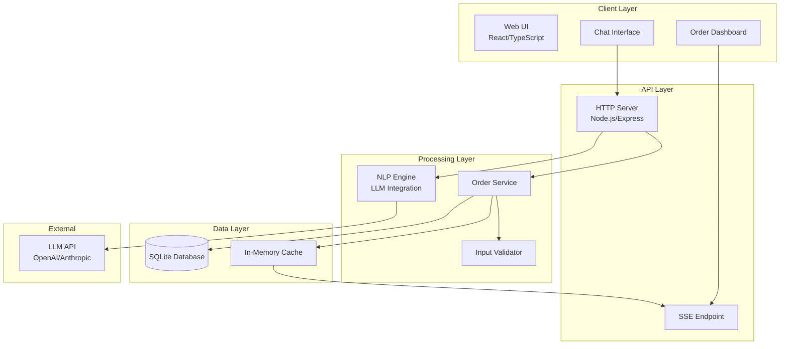
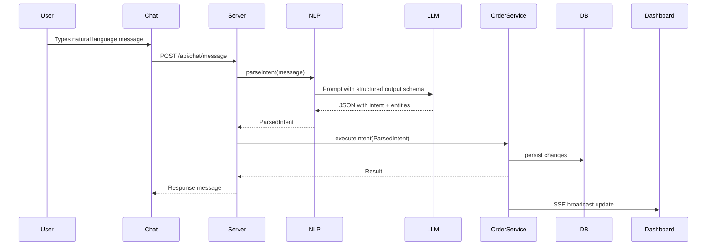
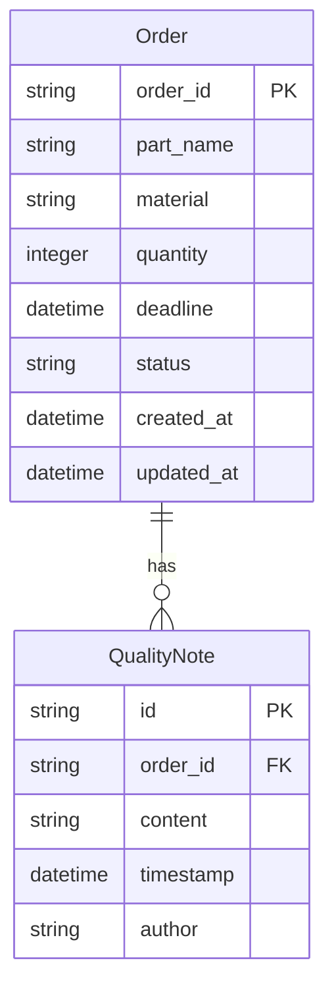

# Design Document: Conversational Order Management System

## Overview

This document presents the technical design for a web-based conversational AI interface for precision manufacturing order management. The system enables users to place orders, check status, and log quality updates entirely through natural language interaction, replacing traditional email, phone, and spreadsheet-based workflows.

### Design Goals

1. **Natural Language First**: All interactions flow through conversational input, eliminating complex forms
2. **Lean Architecture**: Fast, cost-efficient solution without enterprise overhead
3. **Real-Time Visibility**: Dashboard updates instantly as orders progress
4. **Audit Trail**: All quality notes and status changes timestamped and logged

### Key Design Decisions

| Decision | Rationale |
|----------|-----------|
| LLM-based NLP | More flexible than rule-based parsers; handles varied phrasing without training data |
| Server-Sent Events (SSE) | Simpler than WebSockets for one-way dashboard updates; works over standard HTTP |
| In-memory storage with SQLite persistence | Fast for MVP; SQLite provides durability without infrastructure complexity |
| Monolithic architecture | Single deployable unit reduces operational overhead for lean deployment |

---

## Architecture

### System Architecture Diagram



### Component Interaction Flow



### Technology Stack

| Layer | Technology | Rationale |
|-------|------------|-----------|
| Frontend | React + TypeScript | Type safety, component ecosystem |
| Styling | Tailwind CSS | Rapid UI development |
| Backend | Node.js + Express | JavaScript full-stack consistency |
| Database | SQLite | Zero-config persistence, adequate for MVP scale |
| Real-time | Server-Sent Events | Simple server-push for dashboard updates |
| NLP | OpenAI GPT-4 / Anthropic Claude | Reliable structured output, strong entity extraction |

---

## Components and Interfaces

### 1. Chat Interface Component

**Responsibility**: Capture user messages, display conversation history, show system responses.

```typescript
interface ChatMessage {
  id: string;
  role: 'user' | 'assistant' | 'system';
  content: string;
  timestamp: Date;
  metadata?: {
    orderId?: string;
    intent?: IntentType;
    confidence?: number;
  };
}

interface ChatInterfaceProps {
  onSendMessage: (message: string) => Promise<void>;
  messages: ChatMessage[];
  isLoading: boolean;
  currentUserRole: 'user' | 'ops';
}

// Low-level implementation
function ChatInterface({ onSendMessage, messages, isLoading, currentUserRole }: ChatInterfaceProps) {
  const [input, setInput] = useState('');
  
  const handleSubmit = async (e: FormEvent) => {
    e.preventDefault();
    if (!input.trim() || isLoading) return;
    await onSendMessage(input.trim());
    setInput('');
  };

  return (
    <div className="chat-container">
      <MessageList messages={messages} />
      <form onSubmit={handleSubmit}>
        <input
          value={input}
          onChange={(e) => setInput(e.target.value)}
          placeholder="Type your message..."
          disabled={isLoading}
        />
        <button type="submit" disabled={isLoading || !input.trim()}>
          Send
        </button>
      </form>
    </div>
  );
}
```

### 2. Dashboard Component

**Responsibility**: Display all orders in reverse chronological order with real-time updates.

```typescript
interface OrderCard {
  orderId: string;
  partName: string;
  material: string;
  quantity: number;
  deadline: Date;
  status: OrderStatus;
  latestQualityNote: QualityNote | null;
  createdAt: Date;
  updatedAt: Date;
}

interface DashboardProps {
  orders: OrderCard[];
  onOrderSelect: (orderId: string) => void;
}

// Low-level implementation with SSE
function Dashboard() {
  const [orders, setOrders] = useState<OrderCard[]>([]);
  const [connectionStatus, setConnectionStatus] = useState<'connected' | 'disconnected' | 'error'>('disconnected');

  useEffect(() => {
    // Initial load
    fetchOrders().then(setOrders);

    // SSE connection for real-time updates
    const eventSource = new EventSource('/api/orders/stream');
    
    eventSource.onopen = () => setConnectionStatus('connected');
    eventSource.onerror = () => setConnectionStatus('error');
    
    eventSource.onmessage = (event) => {
      const update = JSON.parse(event.data);
      setOrders(prev => {
        const index = prev.findIndex(o => o.orderId === update.orderId);
        if (index >= 0) {
          // Update existing order
          const newOrders = [...prev];
          newOrders[index] = update;
          return newOrders.sort((a, b) => b.updatedAt.getTime() - a.updatedAt.getTime());
        } else {
          // Add new order
          return [update, ...prev];
        }
      });
    };

    return () => eventSource.close();
  }, []);

  if (orders.length === 0) {
    return <EmptyState message="No orders yet. Start a conversation to create your first order." />;
  }

  return (
    <div className="dashboard">
      <ConnectionIndicator status={connectionStatus} />
      <OrderList orders={orders} />
    </div>
  );
}
```

### 3. NLP Engine

**Responsibility**: Parse natural language messages into structured intents and entities.

```typescript
type IntentType = 'create_order' | 'update_status' | 'log_quality' | 'unknown';

interface ParsedIntent {
  intent: IntentType;
  confidence: number;
  entities: {
    // For create_order
    partName?: string;
    material?: string;
    quantity?: number;
    deadline?: Date;
    // For update_status
    orderId?: string;
    status?: OrderStatus;
    // For log_quality
    qualityNote?: string;
  };
  missingFields?: string[];
  rawMessage: string;
}

interface NLPEngine {
  parse(message: string): Promise<ParsedIntent>;
}

// Low-level implementation using LLM with structured output
class LLMBasedNLPEngine implements NLPEngine {
  private client: OpenAIClient;
  private schema: JSONSchema;

  constructor(client: OpenAIClient) {
    this.client = client;
    this.schema = {
      type: 'object',
      properties: {
        intent: {
          type: 'string',
          enum: ['create_order', 'update_status', 'log_quality', 'unknown']
        },
        confidence: { type: 'number', minimum: 0, maximum: 1 },
        entities: {
          type: 'object',
          properties: {
            partName: { type: 'string' },
            material: { type: 'string' },
            quantity: { type: 'integer', minimum: 1 },
            deadline: { type: 'string', format: 'date-time' },
            orderId: { type: 'string', pattern: '^ORD-\\d+$' },
            status: {
              type: 'string',
              enum: ['Received', 'Accepted', 'In Progress', 'Completed', 'Cancelled']
            },
            qualityNote: { type: 'string' }
          }
        },
        missingFields: {
          type: 'array',
          items: { type: 'string' }
        }
      },
      required: ['intent', 'confidence', 'entities']
    };
  }

  async parse(message: string): Promise<ParsedIntent> {
    const prompt = this.buildPrompt(message);
    
    const response = await this.client.chat.completions.create({
      model: 'gpt-4',
      messages: [
        { role: 'system', content: this.getSystemPrompt() },
        { role: 'user', content: prompt }
      ],
      response_format: { type: 'json_object' }
    });

    const parsed = JSON.parse(response.choices[0].message.content);
    return this.validateAndNormalize(parsed, message);
  }

  private getSystemPrompt(): string {
    return `You are an order management assistant. Parse user messages into structured intents.

Intent types:
- create_order: User wants to place a new manufacturing order
- update_status: User wants to update the status of an existing order
- log_quality: User wants to add a quality note to an order
- unknown: Cannot determine intent

Extract all relevant entities. If required fields are missing, list them in missingFields.

Order IDs follow the pattern ORD-XXX where XXX is a number.
Valid statuses: Received, Accepted, In Progress, Completed, Cancelled.

Today's date: ${new Date().toISOString().split('T')[0]}`;
  }

  private buildPrompt(message: string): string {
    return `Parse this message: "${message}"`;
  }

  private validateAndNormalize(parsed: any, rawMessage: string): ParsedIntent {
    // Convert deadline string to Date if present
    if (parsed.entities?.deadline) {
      parsed.entities.deadline = new Date(parsed.entities.deadline);
    }
    
    return {
      ...parsed,
      rawMessage
    };
  }
}
```

### 4. Order Service

**Responsibility**: Manage order lifecycle, persist changes, broadcast updates.

```typescript
type OrderStatus = 'Received' | 'Accepted' | 'In Progress' | 'Completed' | 'Cancelled';

interface Order {
  orderId: string;
  partName: string;
  material: string;
  quantity: number;
  deadline: Date;
  status: OrderStatus;
  qualityNotes: QualityNote[];
  createdAt: Date;
  updatedAt: Date;
}

interface QualityNote {
  id: string;
  orderId: string;
  content: string;
  timestamp: Date;
  author: 'user' | 'ops';
}

interface OrderService {
  createOrder(params: CreateOrderParams): Promise<Order>;
  updateStatus(orderId: string, status: OrderStatus): Promise<Order>;
  addQualityNote(orderId: string, note: string, author: 'user' | 'ops'): Promise<QualityNote>;
  getOrder(orderId: string): Promise<Order | null>;
  getAllOrders(): Promise<Order[]>;
}

interface CreateOrderParams {
  partName: string;
  material: string;
  quantity: number;
  deadline: Date;
}

// Low-level implementation
class SQLOrderService implements OrderService {
  private db: Database;
  private eventEmitter: EventEmitter;
  private idCounter: number;

  constructor(db: Database, eventEmitter: EventEmitter) {
    this.db = db;
    this.eventEmitter = eventEmitter;
    this.idCounter = this.loadLastOrderId();
  }

  async createOrder(params: CreateOrderParams): Promise<Order> {
    const orderId = this.generateOrderId();
    const now = new Date();
    
    const order: Order = {
      orderId,
      status: 'Received',
      qualityNotes: [],
      createdAt: now,
      updatedAt: now,
      ...params
    };

    this.db.run(`
      INSERT INTO orders (order_id, part_name, material, quantity, deadline, status, created_at, updated_at)
      VALUES (?, ?, ?, ?, ?, ?, ?, ?)
    `, [order.orderId, order.partName, order.material, order.quantity, 
        order.deadline.toISOString(), order.status, order.createdAt.toISOString(), order.updatedAt.toISOString()]);

    this.broadcastUpdate(order);
    return order;
  }

  async updateStatus(orderId: string, newStatus: OrderStatus): Promise<Order> {
    const order = await this.getOrder(orderId);
    if (!order) {
      throw new Error(`Order not found: ${orderId}`);
    }

    // Validate state transition
    if (!this.isValidTransition(order.status, newStatus)) {
      throw new Error(`Invalid status transition from ${order.status} to ${newStatus}`);
    }

    const now = new Date();
    this.db.run(`
      UPDATE orders SET status = ?, updated_at = ? WHERE order_id = ?
    `, [newStatus, now.toISOString(), orderId]);

    // Log as quality note
    const note = await this.addQualityNote(orderId, `Status changed from ${order.status} to ${newStatus}`, 'ops');

    const updatedOrder = { ...order, status: newStatus, updatedAt: now, qualityNotes: [...order.qualityNotes, note] };
    this.broadcastUpdate(updatedOrder);
    return updatedOrder;
  }

  async addQualityNote(orderId: string, content: string, author: 'user' | 'ops'): Promise<QualityNote> {
    const order = await this.getOrder(orderId);
    if (!order) {
      throw new Error(`Order not found: ${orderId}`);
    }

    if (order.status === 'Received') {
      throw new Error('Cannot add quality notes to orders with status "Received". Update status first.');
    }

    const note: QualityNote = {
      id: generateUUID(),
      orderId,
      content,
      timestamp: new Date(),
      author
    };

    this.db.run(`
      INSERT INTO quality_notes (id, order_id, content, timestamp, author)
      VALUES (?, ?, ?, ?, ?)
    `, [note.id, note.orderId, note.content, note.timestamp.toISOString(), note.author]);

    this.broadcastUpdate(await this.getOrder(orderId));
    return note;
  }

  private isValidTransition(from: OrderStatus, to: OrderStatus): boolean {
    const validTransitions: Record<OrderStatus, OrderStatus[]> = {
      'Received': ['Accepted', 'Cancelled'],
      'Accepted': ['In Progress', 'Cancelled'],
      'In Progress': ['Completed', 'Cancelled'],
      'Completed': [],
      'Cancelled': []
    };
    return validTransitions[from].includes(to);
  }

  private generateOrderId(): string {
    this.idCounter++;
    return `ORD-${this.idCounter.toString().padStart(3, '0')}`;
  }

  private broadcastUpdate(order: Order): void {
    this.eventEmitter.emit('order:updated', order);
  }
}
```

### 5. Chat Controller

**Responsibility**: Orchestrate message processing, handle conversation flow.

```typescript
interface ChatController {
  handleMessage(message: string, userRole: 'user' | 'ops'): Promise<ChatResponse>;
}

interface ChatResponse {
  message: string;
  success: boolean;
  orderId?: string;
  action?: string;
}

// Low-level implementation
class DefaultChatController implements ChatController {
  private nlpEngine: NLPEngine;
  private orderService: OrderService;

  constructor(nlpEngine: NLPEngine, orderService: OrderService) {
    this.nlpEngine = nlpEngine;
    this.orderService = orderService;
  }

  async handleMessage(message: string, userRole: 'user' | 'ops'): Promise<ChatResponse> {
    try {
      const parsed = await this.nlpEngine.parse(message);

      switch (parsed.intent) {
        case 'create_order':
          return await this.handleCreateOrder(parsed);
        
        case 'update_status':
          return await this.handleUpdateStatus(parsed, userRole);
        
        case 'log_quality':
          return await this.handleLogQuality(parsed, userRole);
        
        case 'unknown':
        default:
          return {
            message: "I'm not sure what you'd like to do. You can:\n" +
                     "• Place a new order (e.g., 'I need 50 steel brackets by Friday')\n" +
                     "• Update order status (e.g., 'Order ORD-042 has been accepted')\n" +
                     "• Log a quality note (e.g., 'Quality check passed for ORD-042')",
            success: false
          };
      }
    } catch (error) {
      return {
        message: `An error occurred: ${error.message}. Please try again.`,
        success: false
      };
    }
  }

  private async handleCreateOrder(parsed: ParsedIntent): Promise<ChatResponse> {
    const missing = this.validateCreateOrderFields(parsed);
    if (missing.length > 0) {
      return {
        message: `I need a few more details to create your order. Please provide: ${missing.join(', ')}`,
        success: false
      };
    }

    const order = await this.orderService.createOrder({
      partName: parsed.entities.partName!,
      material: parsed.entities.material!,
      quantity: parsed.entities.quantity!,
      deadline: parsed.entities.deadline!
    });

    return {
      message: `Order created successfully!\n\n` +
               `Order ID: ${order.orderId}\n` +
               `Part: ${order.partName}\n` +
               `Material: ${order.material}\n` +
               `Quantity: ${order.quantity}\n` +
               `Deadline: ${order.deadline.toLocaleDateString()}\n` +
               `Status: ${order.status}`,
      success: true,
      orderId: order.orderId,
      action: 'order_created'
    };
  }

  private async handleUpdateStatus(parsed: ParsedIntent, userRole: 'user' | 'ops'): Promise<ChatResponse> {
    if (!parsed.entities.orderId) {
      return {
        message: "Which order would you like to update? Please provide the Order ID (e.g., 'ORD-042').",
        success: false
      };
    }

    if (!parsed.entities.status) {
      const validStatuses = ['Accepted', 'In Progress', 'Completed', 'Cancelled'];
      return {
        message: `What status should I set for ${parsed.entities.orderId}? Valid options are: ${validStatuses.join(', ')}`,
        success: false
      };
    }

    try {
      const order = await this.orderService.updateStatus(parsed.entities.orderId, parsed.entities.status);
      return {
        message: `Order ${order.orderId} status updated to "${order.status}".`,
        success: true,
        orderId: order.orderId,
        action: 'status_updated'
      };
    } catch (error) {
      return {
        message: error.message,
        success: false
      };
    }
  }

  private async handleLogQuality(parsed: ParsedIntent, userRole: 'user' | 'ops'): Promise<ChatResponse> {
    if (userRole !== 'ops') {
      return {
        message: "Only operations personnel can log quality notes. Please contact your ops team.",
        success: false
      };
    }

    if (!parsed.entities.orderId) {
      return {
        message: "Which order is this quality note for? Please provide the Order ID.",
        success: false
      };
    }

    if (!parsed.entities.qualityNote) {
      return {
        message: "What quality information would you like to log?",
        success: false
      };
    }

    try {
      const note = await this.orderService.addQualityNote(
        parsed.entities.orderId,
        parsed.entities.qualityNote,
        userRole
      );
      return {
        message: `Quality note logged for ${note.orderId} at ${note.timestamp.toLocaleString()}.`,
        success: true,
        orderId: note.orderId,
        action: 'quality_logged'
      };
    } catch (error) {
      return {
        message: error.message,
        success: false
      };
    }
  }

  private validateCreateOrderFields(parsed: ParsedIntent): string[] {
    const missing: string[] = [];
    if (!parsed.entities.partName) missing.push('part name');
    if (!parsed.entities.material) missing.push('material');
    if (!parsed.entities.quantity) missing.push('quantity');
    if (!parsed.entities.deadline) missing.push('deadline');
    return missing;
  }
}
```

### 6. SSE Event Manager

**Responsibility**: Manage SSE connections, broadcast order updates to connected clients.

```typescript
interface SSEEventManager {
  addClient(res: Response): void;
  removeClient(clientId: string): void;
  broadcast(order: Order): void;
}

// Low-level implementation
class DefaultSSEEventManager implements SSEEventManager {
  private clients: Map<string, Response>;

  constructor() {
    this.clients = new Map();
  }

  addClient(res: Response): void {
    const clientId = generateUUID();
    
    // Set SSE headers
    res.writeHead(200, {
      'Content-Type': 'text/event-stream',
      'Cache-Control': 'no-cache',
      'Connection': 'keep-alive',
      'X-Accel-Buffering': 'no' // Disable nginx buffering
    });

    // Send initial connection message
    res.write(`event: connected\ndata: ${JSON.stringify({ clientId })}\n\n`);
    
    this.clients.set(clientId, res);
  }

  removeClient(clientId: string): void {
    this.clients.delete(clientId);
  }

  broadcast(order: Order): void {
    const data = JSON.stringify(this.toDashboardFormat(order));
    const message = `event: order_update\ndata: ${data}\n\n`;

    // Send to all connected clients
    for (const [clientId, res] of this.clients) {
      try {
        res.write(message);
      } catch (error) {
        // Client disconnected
        this.removeClient(clientId);
      }
    }
  }

  private toDashboardFormat(order: Order): OrderCard {
    return {
      orderId: order.orderId,
      partName: order.partName,
      material: order.material,
      quantity: order.quantity,
      deadline: order.deadline,
      status: order.status,
      latestQualityNote: order.qualityNotes[order.qualityNotes.length - 1] || null,
      createdAt: order.createdAt,
      updatedAt: order.updatedAt
    };
  }
}
```

---

## Data Models

### Entity Relationship Diagram



### Database Schema

```sql
-- Orders table
CREATE TABLE orders (
    order_id TEXT PRIMARY KEY,
    part_name TEXT NOT NULL,
    material TEXT NOT NULL,
    quantity INTEGER NOT NULL CHECK (quantity > 0),
    deadline TEXT NOT NULL,
    status TEXT NOT NULL DEFAULT 'Received' 
        CHECK (status IN ('Received', 'Accepted', 'In Progress', 'Completed', 'Cancelled')),
    created_at TEXT NOT NULL,
    updated_at TEXT NOT NULL
);

-- Quality notes table
CREATE TABLE quality_notes (
    id TEXT PRIMARY KEY,
    order_id TEXT NOT NULL,
    content TEXT NOT NULL,
    timestamp TEXT NOT NULL,
    author TEXT NOT NULL CHECK (author IN ('user', 'ops')),
    FOREIGN KEY (order_id) REFERENCES orders(order_id) ON DELETE CASCADE
);

-- Index for efficient quality note queries
CREATE INDEX idx_quality_notes_order_id ON quality_notes(order_id);
CREATE INDEX idx_quality_notes_timestamp ON quality_notes(timestamp);

-- Index for order list queries
CREATE INDEX idx_orders_updated_at ON orders(updated_at DESC);
```

### TypeScript Type Definitions

```typescript
// Core domain types
type OrderStatus = 'Received' | 'Accepted' | 'In Progress' | 'Completed' | 'Cancelled';
type UserRole = 'user' | 'ops';

interface Order {
  orderId: string;
  partName: string;
  material: string;
  quantity: number;
  deadline: Date;
  status: OrderStatus;
  qualityNotes: QualityNote[];
  createdAt: Date;
  updatedAt: Date;
}

interface QualityNote {
  id: string;
  orderId: string;
  content: string;
  timestamp: Date;
  author: UserRole;
}

// API types
interface CreateOrderRequest {
  partName: string;
  material: string;
  quantity: number;
  deadline: string; // ISO date string
}

interface ChatMessageRequest {
  message: string;
  userRole: UserRole;
}

interface ChatMessageResponse {
  response: string;
  success: boolean;
  orderId?: string;
  action?: 'order_created' | 'status_updated' | 'quality_logged';
}

// Dashboard types
interface OrderCard {
  orderId: string;
  partName: string;
  material: string;
  quantity: number;
  deadline: Date;
  status: OrderStatus;
  latestQualityNote: QualityNote | null;
  createdAt: Date;
  updatedAt: Date;
}
```

---

## Error Handling

### Error Categories

| Category | HTTP Status | Example | User Message |
|----------|-------------|---------|--------------|
| Validation | 400 | Missing required field | "Please provide the missing field: [field name]" |
| Not Found | 404 | Order ID not found | "Order [ID] not found. Please check the order ID." |
| Business Rule | 422 | Invalid status transition | "Cannot change status from [current] to [requested]" |
| Authorization | 403 | User attempting ops action | "Only operations personnel can perform this action" |
| External | 502 | LLM API failure | "Unable to process your request. Please try again." |
| Internal | 500 | Database error | "An unexpected error occurred. Please try again." |

### Error Response Format

```typescript
interface ErrorResponse {
  error: {
    code: string;
    message: string;
    details?: Record<string, unknown>;
  };
}

// Example implementation
function handleError(error: unknown): ErrorResponse {
  if (error instanceof ValidationError) {
    return {
      error: {
        code: 'VALIDATION_ERROR',
        message: error.message,
        details: { field: error.field }
      }
    };
  }

  if (error instanceof NotFoundError) {
    return {
      error: {
        code: 'NOT_FOUND',
        message: error.message
      }
    };
  }

  // Log internal errors
  console.error('Internal error:', error);
  
  return {
    error: {
      code: 'INTERNAL_ERROR',
      message: 'An unexpected error occurred. Please try again.'
    }
  };
}
```

### NLP Error Recovery

When the NLP engine cannot determine intent or extract entities:

```typescript
async function handleUncertainIntent(parsed: ParsedIntent): Promise<ChatResponse> {
  if (parsed.confidence < 0.5) {
    return {
      message: "I'm not quite sure what you mean. Could you rephrase that?\n\n" +
               "For example:\n" +
               "• 'I need 100 aluminum brackets by next Monday'\n" +
               "• 'Update order ORD-042 to accepted'\n" +
               "• 'Log quality note for ORD-042: passed inspection'",
      success: false
    };
  }

  if (parsed.missingFields && parsed.missingFields.length > 0) {
    return {
      message: `I understood you want to ${parsed.intent.replace('_', ' ')}, but I need more information: ${parsed.missingFields.join(', ')}`,
      success: false
    };
  }

  // Proceed with action
  return executeIntent(parsed);
}
```

---

## Correctness Properties

*A property is a characteristic or behavior that should hold true across all valid executions of a system-essentially, a formal statement about what the system should do. Properties serve as the bridge between human-readable specifications and machine-verifiable correctness guarantees.*

### Property 1: Order Creation Response Structure

*For any* successfully created order, the system response SHALL contain the orderId, partName, material, quantity, deadline, and status fields.

**Validates: Requirements 1.5**

### Property 2: New Orders Have Received Status

*For any* newly created order, the order status SHALL be "Received".

**Validates: Requirements 1.2**

### Property 3: Order ID Uniqueness

*For any* sequence of order creations, all generated Order IDs SHALL be unique.

**Validates: Requirements 1.4**

### Property 4: Missing Fields Detection

*For any* order request with missing required fields, the system SHALL identify and report the exact missing fields in the error response.

**Validates: Requirements 1.3, 7.2**

### Property 5: Valid Status Transitions

*For any* order and any status transition, the system SHALL allow the transition if and only if it follows the valid state machine: Received → Accepted, Accepted → In Progress, In Progress → Completed, or any status → Cancelled (except Completed).

**Validates: Requirements 2.2**

### Property 6: Status Update Creates Quality Note

*For any* successful status update, the system SHALL create a quality note recording the status change with a valid timestamp.

**Validates: Requirements 2.3**

### Property 7: Invalid Order ID Error

*For any* operation referencing a non-existent Order ID, the system SHALL return an error indicating the order was not found.

**Validates: Requirements 2.4**

### Property 8: Quality Note Precondition

*For any* order with status "Received", quality note submissions SHALL be rejected with an error message prompting status update first. *For any* order with status "Accepted", "In Progress", or "Completed", quality note submissions SHALL be accepted.

**Validates: Requirements 3.1, 3.5**

### Property 9: Quality Note Attachment

*For any* quality note added to an order, the note SHALL be retrievable when querying that order's quality notes list.

**Validates: Requirements 3.3**

### Property 10: Quality Note Chronological Order

*For any* order with multiple quality notes, the notes SHALL be retrievable in chronological order by timestamp.

**Validates: Requirements 6.4**

### Property 11: Dashboard Chronological Ordering

*For any* set of orders displayed on the dashboard, the orders SHALL be listed in reverse chronological order by last update time (most recent first).

**Validates: Requirements 4.1**

### Property 12: Dashboard Data Completeness

*For any* order displayed on the dashboard, the dashboard card SHALL contain orderId, partName, status, and latestQualityNote fields.

**Validates: Requirements 4.2**

### Property 13: Intent Classification Validity

*For any* chat message, the classified intent SHALL be one of: "create_order", "update_status", "log_quality", or "unknown".

**Validates: Requirements 5.1**

### Property 14: Role-Based Authorization

*For any* user with role "user", the system SHALL allow order creation and status queries. *For any* user with role "ops", the system SHALL allow order creation, status updates, and quality note logging. *For any* user with role "user" attempting quality note logging, the system SHALL deny the request with an appropriate message.

**Validates: Requirements 8.3, 8.4, 8.5**

### Property 15: Error Response Structure

*For any* error condition during message processing, the system SHALL return a response containing a clear error message describing the issue.

**Validates: Requirements 7.1**

### Property 16: System Responsiveness After Error

*For any* error response, the system SHALL remain responsive and accept new messages from the user.

**Validates: Requirements 7.4**

### Property 17: SSE Broadcast on Order Update

*For any* order update (create, status change, or quality note addition), the system SHALL broadcast an SSE event containing the updated order data to all connected dashboard clients.

**Validates: Requirements 4.5**

---

## Testing Strategy

This feature involves UI interactions, NLP processing with external LLM calls, and business logic that is well-suited for property-based testing.

### Test Categories

| Category | Tools | Coverage |
|----------|-------|----------|
| Property-based | fast-check | Universal properties, parsing logic, state transitions |
| Unit | Vitest | Individual functions, validators, transformers |
| Integration | Vitest + supertest | API endpoints, database operations |
| E2E | Playwright | Full user flows through chat interface |

### Property-Based Testing

The following properties will be tested using property-based testing:

**PBT Library**: fast-check (JavaScript/TypeScript)

#### Properties to Test

1. **Intent Classification Consistency**: For any message classified as a specific intent, the same message should always classify to the same intent.

2. **Order State Machine Validity**: For any valid status transition, the order should move to the new state; for any invalid transition, the operation should fail.

3. **Quality Note Ordering**: For any order with multiple quality notes, notes should always be retrievable in chronological order.

4. **Order ID Generation Uniqueness**: For any sequence of order creations, all generated IDs should be unique.

5. **SSE Message Format**: For any order broadcast, the SSE message should contain valid JSON with all required fields.

### Unit Tests

```typescript
describe('OrderService', () => {
  describe('createOrder', () => {
    it('should create order with status Received', async () => {
      const service = createTestOrderService();
      const order = await service.createOrder({
        partName: 'Bracket',
        material: 'Steel',
        quantity: 100,
        deadline: new Date('2025-12-31')
      });
      
      expect(order.status).toBe('Received');
      expect(order.orderId).toMatch(/^ORD-\d{3}$/);
    });
  });

  describe('updateStatus', () => {
    it('should allow Received -> Accepted transition', async () => {
      const service = createTestOrderService();
      const order = await createTestOrder(service);
      
      const updated = await service.updateStatus(order.orderId, 'Accepted');
      expect(updated.status).toBe('Accepted');
    });

    it('should reject Received -> In Progress transition', async () => {
      const service = createTestOrderService();
      const order = await createTestOrder(service);
      
      await expect(
        service.updateStatus(order.orderId, 'In Progress')
      ).rejects.toThrow('Invalid status transition');
    });
  });

  describe('addQualityNote', () => {
    it('should reject quality notes for Received orders', async () => {
      const service = createTestOrderService();
      const order = await createTestOrder(service);
      
      await expect(
        service.addQualityNote(order.orderId, 'Test note', 'ops')
      ).rejects.toThrow('Cannot add quality notes');
    });

    it('should allow quality notes for Accepted orders', async () => {
      const service = createTestOrderService();
      const order = await createTestOrder(service);
      await service.updateStatus(order.orderId, 'Accepted');
      
      const note = await service.addQualityNote(order.orderId, 'Test note', 'ops');
      expect(note.content).toBe('Test note');
    });
  });
});
```

### Integration Tests

```typescript
describe('Chat API', () => {
  describe('POST /api/chat/message', () => {
    it('should create order from natural language', async () => {
      const response = await request(app)
        .post('/api/chat/message')
        .send({
          message: 'I need 50 aluminum brackets by Friday',
          userRole: 'user'
        });
      
      expect(response.status).toBe(200);
      expect(response.body.success).toBe(true);
      expect(response.body.orderId).toMatch(/^ORD-\d{3}$/);
      expect(response.body.action).toBe('order_created');
    });

    it('should reject ops-only actions from users', async () => {
      // Create order first
      await createTestOrder();
      
      const response = await request(app)
        .post('/api/chat/message')
        .send({
          message: 'Log quality note for ORD-001: passed inspection',
          userRole: 'user'
        });
      
      expect(response.status).toBe(200);
      expect(response.body.success).toBe(false);
      expect(response.body.response).toContain('Only operations personnel');
    });
  });
});
```

### Test Configuration

```typescript
// vitest.config.ts
export default defineConfig({
  test: {
    include: ['**/*.test.ts'],
    property: {
      // Run each property test 100 times
      numRuns: 100
    }
  }
});
```

---

## Implementation Phases

### Phase 1: Core Infrastructure
- Set up project structure
- Implement database schema
- Create basic Express server
- Implement OrderService

### Phase 2: NLP Integration
- Implement NLP Engine with LLM
- Create ChatController
- Handle all intent types
- Implement error recovery

### Phase 3: Real-Time Dashboard
- Implement SSE endpoint
- Create Dashboard React component
- Wire up real-time updates

### Phase 4: Polish & Testing
- Add comprehensive tests
- Error handling refinement
- UI styling
- Documentation
